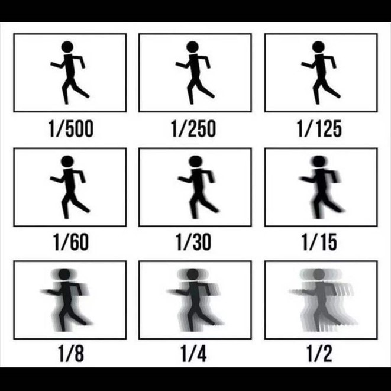
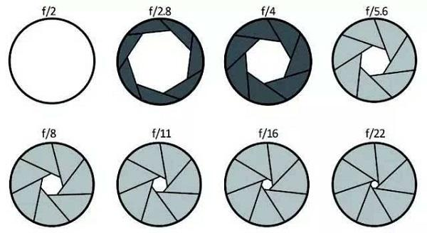
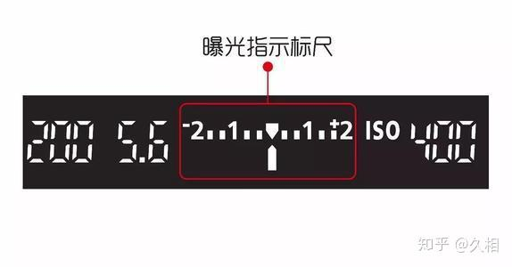
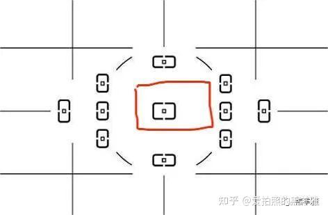

### 前言

今天，你正式入职了。当你满怀期待地打开工作室发给你的单反相机，你却失望的发现——太难用了！

这操作逻辑根本和你的直觉大相径庭！怎么会有这么反人类的数码产品！

于是你失望极了，拿着相机给 Coser 老师摁了一张，换来的却是 “老师，我的脸怎么亮亮的？”

你这儿才想起来，你是个连相机都没摸过的小白！连 “先对焦再构图” 都不会，更别提怎么控制曝光了。

于是你急急忙忙找你亲爱的星鼠老师求助，他斟酌再三，决定还是帮你一把。于是，他从最基础的曝光三要素开始讲起了。

### 第一节 曝光三要素

首先，我们要学习如何控制画面亮度。

画面亮度由三个因素共同控制：快门速度、光圈、ISO（感光度）。我们通常将这三者称为 “曝光三要素” 。

* 快门速度

  * 快门帘落下的速度。可以以此控制光线进入传感器的量从而控制画面亮度。

  * 快门速度常以 1/n s 表示，可以简写成 1/n。（如 1/4000，1/250，1/60）

  * 快门速度越快，快门帘落下得越快，传感器接收到的光线也就越少，画面也就越暗。同理，快门速度越慢，快门帘落下得越慢，传感器接收到的光线也就越多，画面也就越亮。

  * 可以利用低快门速度来营造动态感，高快门速度营造凝固感。

  

* 光圈

  * 镜头通光孔的大小。光圈值越大，光圈越小。（如 f22 的孔径就远小于 f1.2）光圈大小同样可以控制光线进入传感器的量。光圈值常用 f 来表示。

  * 光圈还可以控制背景虚化，光圈大小可以决定背景的虚化量，当你想要突出主体时，不妨调到大光圈来虚化背景。（这种手法常用于人像拍摄来突出人物）

  

* ISO 感光度

  * 传感器对于光线的敏感程度。ISO 越大，画面越亮。

    * 注意！调整 ISO 并不能调整光线本身照入传感器的量，所以当 ISO 越大但是射入传感器的光本身就很少时，画面纯净度会大幅下降（即画面噪点增加）。

    * 建议：ISO 在通常情况下越低越好，以下是几个常用的基础档位：

当画面光亮发生改变时，如你使用 M（手动）模式，调整三者的优先级如下：

快门速度 > 光圈 > ISO

恭喜你，学会了曝光三要素！于是你一拍脑门，决定给 Coser 老师再拍一张。

可你正打算赶过去时，一件意外的事情发生了。你发现自己的相机好像不听使唤，拨动波轮并无法改变快门速度，只能改变光圈值。你很疑惑，于是又去咨询了星鼠老师。星鼠无语的看着你，无奈之下转动了一下相机顶上的小转盘。你惊奇地发现，原本动不了的快门速度居然可以动了。你连忙谢过星鼠，他开始无奈的跟你讲起了相机模式的用途。

### 第二节 相机模式

学习完曝光三要素之后，如何在相机上正确使用也是很重要的。而相机模式正是帮我们正确曝光的利器。

相机模式可以在相机顶上的模式转盘进行调节。

* M 手动

  * 可以自由调整曝光三要素的模式。在显示屏底部会给出曝光建议。漫展灯阵的最常用模式。

  * 关于曝光建议：

    * 曝光建议也被称为“曝光标尺”，形如一根 0 刻度线在中间的刻度尺。如下图所示。

    

    当曝光指示标尺指向 0 刻度线时，此时为相机推荐的曝光参数。在使用 M 模式时，我们的目标就是调整参数，直到标尺指针指向零刻度线。

* Av 光圈优先

  * 使用给定的光圈值以及感光度，由机器自动调节快门速度的模式。这几乎可以说是外景最常用的模式了。某些厂商会将其称之为 A 模式。

* Tv 快门速度优先

  * 锁定快门和 ISO , 交由机器自动测光并自动调节光圈大小的模式。

* P 程序自动

  * 曝光三要素完全交给机器调整的模式。

你又解锁了如何使用相机模式！可就当你兴冲冲去找 Coser 老师按了一张之后，人家老师脸都被你气红了！

“老师老师我的脸怎么糊糊的？”她很生气地问。

这时你支支吾吾，简直想找个地缝钻进去。“帮帮我，万能的星鼠老师！”于是可怜的星鼠只好又双叒叕教你怎么对焦了。

### 第三节 对焦

众所周知，云糖穷的要命，给大家发的都是些像是 佳能 6D、佳能 5D3 这种抽象老单反。如果你没有用云糖发给你的设备那么恭喜你，这一节的后半部分可以直接跳过了。因为各大厂商的新单反和微单早已克服对焦难题，你完全可以闭着眼睛交给机器去对焦。

但如果你和我一样用着命苦的老单反的话，那这一整节将是你不得不品的一环。

* 对焦原理

  * 我们先来看看维基百科上的解释：

    > 对焦是透过相机镜头中镜片组的前后移动，改变像距的位置，使物像恰好落在底片或感光元件上。

    我们可以对这句话这样理解：

    假设你的面前有个平面，平面上的物体都清晰无比，越远离平面的物体越模糊。这时候如果我们想看清晰一个物体该怎么做？

    要么物体动，要么平面动对吧。但是大多数时候物体是不听你话的，这时候我们需要将平面移动。

    移动这个平面来看清物体的过程，就叫对焦。而这个平面，我们一般称之为焦平面。

    没错，所谓对焦就是那么简单朴实。但是为了让你不亲自动手对焦，提升你的体验感（实际上是为了骗走你口袋里的那几块钱），各大相机厂商可谓是花足了心思。最开始是的自动对焦方式是反差对焦、黄斑对焦，然后又到相位对焦，技术在不断地进步，准焦率越来越高……

    但是很不幸，拿到老单反的各位是吃不到这个技术红利的o(TヘTo)，老单反只有单点反差对焦。

    既然如此，那我们该如何在如此艰苦环境下跑去漫展圈米呢？常言道，艰苦环境创造奇妙方案，我们的老前辈们为了克服老单反的垃圾对焦，想出来了一大堆解决方案。

* 对焦小技巧

  * 先对焦再构图

    * 将相机取景器的中心点对准人脸，按住对焦按键直到红灯闪烁并听到滴滴声，这时说明对焦完成。对焦完成后开始构图，构图结束后按下快门键即可。

    

    * 后键对焦

      * 前文提到一个概念，叫做对焦键。关于对焦键，相信大家有不少疑问：明明半按快门就可以解决的事，为什么偏要设计这么一个 AF-ON 按键来对焦？你想啊，如果你构图的时候一不小心松了手，没半按快门，是不是又要重新对焦啦？这时候我们把半按快门对焦关闭，改为采用 AF-ON 按键对焦，这时候星鼠审片的时候再也不用担心我虚焦啦！

      * 后键对焦的基本原理是将对焦键和快门键分离，起到防误触和锁定对焦的作用。

      * 使用后键对焦只要把中心对焦点对准模特的脸按下 AF-ON 按键，听到合焦声后松开，然后再去构图，按下快门键就可以了。

    学习完后键对焦之后，你花费了九牛二虎之力把 Coser 老师哄回来当你的模特，于是对准了她的脸，再一次小心翼翼地按下了快门键。终于！Coser 老师的人也不过曝了、脸也不糊了，疗效显著！给 Coser 老师看了照片之后她也勉强满意，在你的哀求下决定当你的互勉模特。

    你非常开心，但是在开心之余你又开始想了——"总感觉这照片差了点意思……"，于是你开始观察大师们的作品，隐隐约约察觉到了某种你所欠缺的东西，是什么呢？终于在一个月黑风高大雨滂沱的夜晚，你在工作室的飞书知识库里翻看到了一本星鼠老师写的叫做《漫展摄影指南：进阶摄影教程》的书，你恍然大悟！

    构图！测光模式！闪光灯！原来你还有这么多要学的东西！

    于是在"拍好照片，不让 Coser 失望"这一原动力的驱使下，你开始学习这本书了。

最后，你基本学会了怎么去正确拍照！可你发现，为什么我拍出来的就是离大神们差距这么大？而且他们都会用闪光灯是什么鬼？

别着急，在接下来的几章，你将会学到这些，虽说不能让你成为大神，但是让你拉进和大神之间的距离是可以的（笑）。

