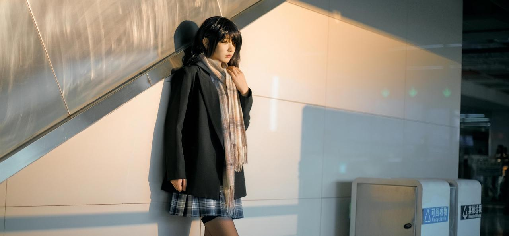
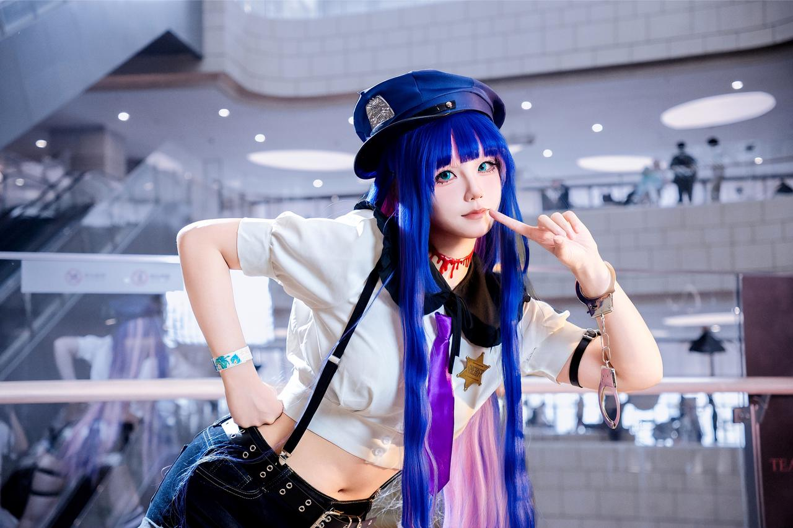
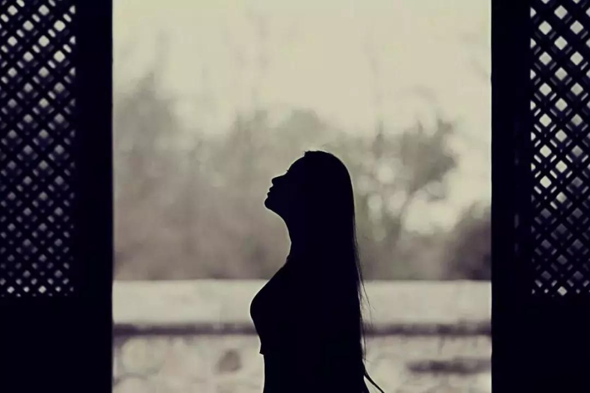
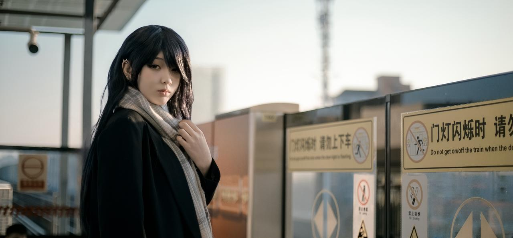

书接上文，这一天，你打开了云糖内部的飞书，在知识库里找到《进阶摄影教程》，打算看看为什么自己的照片总是差点意思，你左翻翻右翻翻，终于在字里行间里看到了解决问题的那两个字——"构图"！

***

首先我们来聊聊构图。构图，简单来说就是根据表达的思想将拍摄画面中的元素适当的组织起来。根据主体在画面中的位置，我们可以把构图分为以下几种：

* 中心构图

  * 中心构图是将主体放置在画面视觉中心，再利用其它元素烘托和呼应主题，形成视觉焦点的一种构图手法。

  * 中心构图的特点：

    * 凸显主体。将主体放置在画面的中心进行构图，可以突出主体的存在感。这样的方法可以让主体占据版面的视觉中心，可以最直观的引导观众观看主体。

    * 中心构图是最容易用习惯的构图，注意在使用时需避免呆板，还要避免一直使用中心构图，在恰当的时候请尝试一些其它构图吧。

      

* 三分构图

  * 三分构图是将主体放置在画面的三分线上，利用三分线之外的画面烘托情绪并且引导观众观看三分线内的主体。

  * 在人像摄影中，三分构图需要把人物的眼睛或者面部放置在画面横纵三分线的交点上，背景沿分割线延伸可以增强故事性。

  * 三分构图的特点

    * 平衡与稳定：通过对称分布元素，营造和谐感。

    * 层次感和空间感：利用前景、中景、背景的分区布局，甚至可以结合引导线强化纵深感。

  * 注意：当画面三分线外没有其它物体来引导观众观看主体时，切忌使用三分构图！！！

  

* 对角线构图

  * 对角线构图在人像摄影中指的是将主体放置在对角线上，使得图片更加有动态张力，更加活泼。

  * 对角线构图常与引导线同用，可以尝试将二者结合。

  * 在使用对角线构图时，可以试着将主体稍微摆正一点，不用严格沿着对角线摆放，这样的话可以带来良好的观感。

  

* 框架式构图

  * 框架式构图是指选择一个框架作为画面的前景，引导观众的视线到拍摄主体上，以此来突出主体。

  * 这种构图方法不仅能增加画面的纵深感和立体感，还能增强视觉冲击力，使主体与环境相呼应。

    * 具体来说，框架式构图可以利用自然界的元素，如树枝、树叶、花朵，或是建筑中的门框、窗户等作为框架，将主体置于框架内。通过这种方式，拍摄者可以有效地引导观者的注意力，同时利用框架的虚化效果来渲染氛围，提升照片的艺术感。

      

* 引导线构图

  终于讲到引导线构图了！引导线构图在构图领域简直是万金油！

  * 在照片中，会有一条或多条线条在不自觉的吸引你的眼球，我们的目光一直跟随着线条的走向而移动，这些线条通过照片引导着我们的目光，这些线条就被称“引导线”。

  * 引导线可以是河流、车流、光线投影、长廊、街道、一串灯笼和车厢。只要是有方向性的、连续的点或线起到引导视觉的作用，我们都可以称之为引导线。它不仅是直线、对角线、弧线，也可能会是一个平面，大家都理解面是由线组成的道理。

  * 引导线构图可以与多种构图相结合，这一招在人像摄影中屡试不爽。建议大家可以多试试。

看到这里，你不由得对星鼠产生了敬意。见鬼，他到底是写了多久把这些东西总结起来！

这时你顾不上那么多了，赶紧把 Coser 老师摇了过来拍照。当你仔仔细细抠构图，按下快门的那一瞬间，你感觉自己的思维得到了升华。果然，拍出的照片没以前那么没有章法了！

但是，这天是艳阳天，阳光呛得你眼睛生疼，也把你的照片给毁了——照片里 Coser 老师的脸变得黑黑的了！你开始怒火中烧，埋怨起世界的不公，为什么偏偏要在这时候出那么大太阳！

为了让你下次拍照再也不靠老天爷赏饭吃，你打开了《进阶摄影教程》，并且找到了救命之法。
