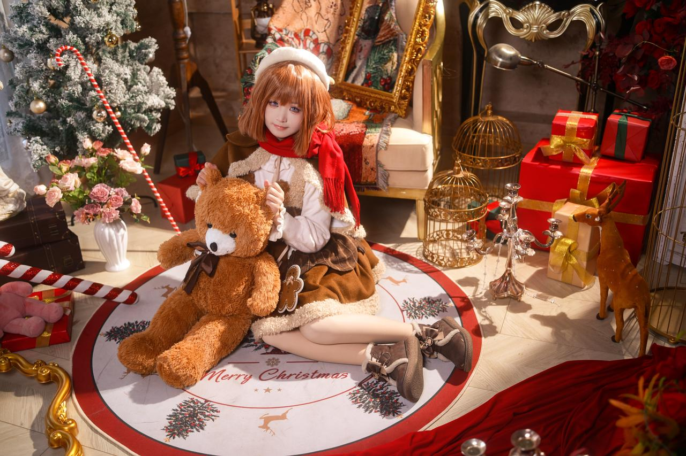
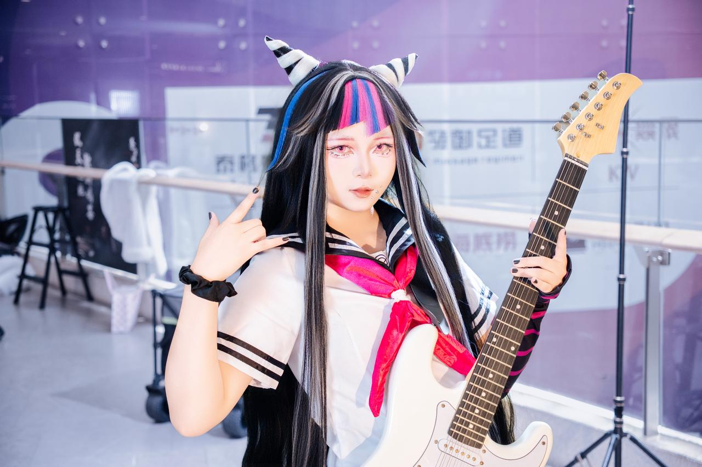

作为一名摄影师，我们都知道镜头有着两个基本参数：焦段和最大光圈。但只有个基本概念是不行的，我们需要进一步了解不同的焦段和光圈是用来做什么的。

改变焦距大小的效果我们可以粗略的视为改变照片中主体的远近。

为什么是粗略呢？因为有一个因素无法忽略：透视。

透视，是一个绘画中的概念，指的是在二维的平面或曲面上描绘物体的空间关系的方法或技术。

也就是说，透视其实就是观众在观看一个二维画面中的物体空间关系，观看的角度不同，所形成的物体的空间位置、轮廓和投影不同的画面空间感。

只需知道一点，焦距越短（广)，视角越广，拍人像时能营造的透视感越强。

广角镜头能强调画面的透视效果，近大远小的透视得到很好夸张，照片空间感、立体感强，这有利于增强画面的感染力。

所以我们一般都利用广角镜头（指焦段为 20-35 mm）的广视角创造大张力的动作场景。

那中焦镜头（35-50 mm）和长焦镜头（50-135 mm）呢？它们又有什么用处呢?

* 35 mm 镜头

  * 等效人眼双眼视角。会营造出一种亲切感。35 mm 镜头被称为最难利用的镜头之一。因为它的视角太亲切太日常了，如果在构图上没有作出突破的活会显得十分平庸，好似日常照一般。所以如果你成为了 35mm 使用者的话，你在逼格上就压别人一头 (bushi)。

    

* 50 mm 镜头

  * 等效人眼单眼视角。也会营造出一种亲切感，但与 35 mm 不同的是，50 mm 镜头亲切而又陌生，所以 50 mm 是一种很好使用的镜头（因为陌生感会让人眼前一亮），构图方面的瑕疵不会像使用 35 mm 镜头时被放大。被誉为“万金油”。

    

* 85 mm 镜头

  * 超脱了人眼视角的人像标准镜头。营造出极致的陌生感和空间压缩感，被誉为”美人镜”。

  * 因为 85 mm 属于长焦，焦段较长，所以在相同光圈下，85 mm 的弥散圆（即虚化光斑）直径会比 35 mm 和 50 mm 来得更大一些，这时就能获得一个较强的背景虚化，更能突显主体。

  .jpg)

这时候你就要问了，这么多焦段的镜头，我换来换去岂不是很麻烦？

这时候我将要向你介绍摄影史上最伟大的发明之一——变焦镜头！（笑）

初次接触镜头的焦段，你内心焦灼难耐，恨不得现在就把所有的镜头焦段补齐！在欲望的驱使下，你购买了 28-70 f/2、85 f/1.2 等诸多超规格镜头，想着立马大干一场。于是，你又找到了 Coser 老师拍照。你难以抑制内心的喜悦，在拍摄过程中频繁更换镜头，想要试试每个镜头的用法。

“别换你那个逼镜头了，你到底还拍不拍？！！！”

终于，Coser 忍不住了，抬手就是一个大嘴巴子。突然，你从床上惊醒！

“我的超规格镜头啊啊啊啊啊啊o(TヘTo)”原来你从来不曾拥有过超规格镜头，陪伴着你的只有那你掏光家底买的老单反和老镜头，这让你心里一阵失落。&#x20;
