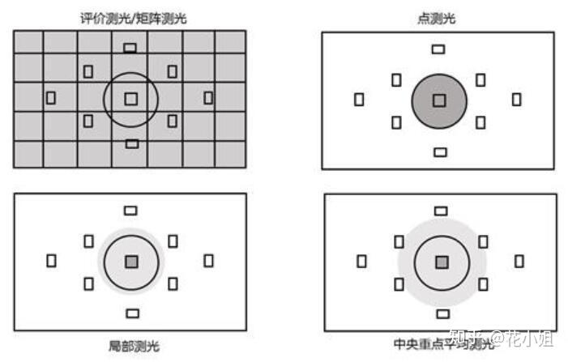

上回书说到，使用光圈优先自动曝光和快门优先自动曝光会使机器进入自动测光模式，智能判断曝光参数。（见《Marshmallow 漫展摄影指南：基础摄影教程》）但是，机器判断曝光参数的原理的是依靠画面中标定测光区域为 18 度灰来进行测光的。不同的测光区域会导致判断出来的曝光参数不同，效果也大相径庭。

一般来说，我们会把主体标定为测光区域，使主体获得一个正确的曝光。但如果我们想拍剪影怎么办？只要把背景标定为测光区域就好啦！这时候背景就会获得一个正确的曝光，而主体会因为无法获得正确曝光而欠曝，就像这样：

.jpg)

而机器智能判断测光区域的方法，我们将其称为测光模式。

* 评价测光（也被称为矩阵测光）

  * 评价测光是大多数相机的默认测光模式。把拍摄画面分成多个测光区域，对每个区域分别测光，然后在整体加权计算曝光，这就是评价测光的原理。

  * 评价测光适用于大多数拍摄场合。

* 点测光

  * 点测光是对拍摄画面中很小的一部分进行测光，通俗讲就是对一个点的测光。这样的模式可以更准确的对画面中你认为最适合地方进行测光，而不会受到其它影响。

  * 在索尼三代机及其以后的机型中，有一个特别好用的模式叫做“点测光对焦点联动”。这样的话会自动将测光点放在对焦点下，可以方便快捷地对对上焦的主体进行测光。

* 局部测光

  * 只对拍摄画面中央的一块区域进行测光的测光模式叫做点测光。

* 中央重点平均测光

  * 中央重点平均测光是指相机把拍摄画面中央部分的测光数据占据绝大部分比例，而画面中央以外的测光数据作为小部分比例起到测光的辅助作用，经过相机的处理器对这两部分数值加权平均之后的比例，得到拍摄的相机测光数据。大多数相机的测光算法是重视画面中央约2/3的位置，对周围给予少量的考虑。通俗讲就是以画面中央位置的测光为主，这样的算法就是对于主体进行主要测光。

  * 这是一种比较常用的测光模式，中央重点平均测光使曝光更加均匀，减少画面反差，画面更清晰。

而当我们发现测光出现了一点问题，画面总是过曝或者欠曝时，我们可以使用曝光补偿强制将画面提亮或者压暗。

想要使用曝光补偿，必须处于使用相机自动测光的模式之一，例如光圈优先、快门优先、程序模式等。在手动模式下，除非打开了自动 ISO，否则曝光补偿不起作用。一旦选择了合适的相机模式，就可以使用相机的曝光补偿功能来调整图像的亮度。

学完了测光模式和曝光补偿，你对自己的摄影技术更有了一点信心。于是你又双叒叕去找了 Coser 老师，按下了快门键。

终于！功夫不负有心人，你拍出来的照片已经没有任何的低级错误了！可喜可贺！

但是，你是一个很上进的人，你不满足于只拍出没有低级错误的照片。要成，就成为摄影大师！

你在无意中翻到了《进阶摄影教程》有关于镜头的一节，你察觉到，善用镜头的焦段和光圈似乎能帮你的摄影走向一个新的顶峰！

于是，你继续开始了学习。
