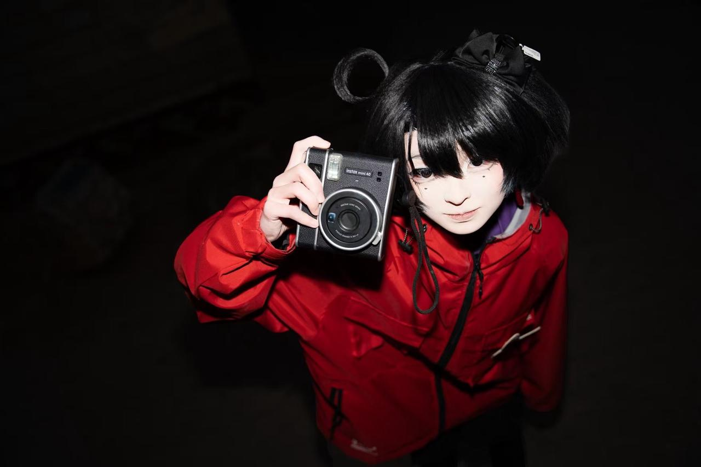
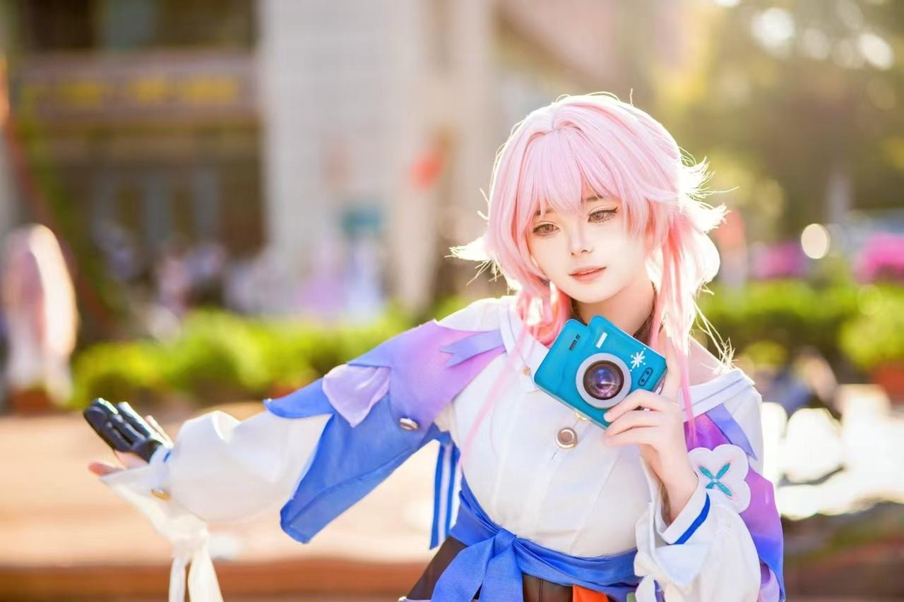

**注：关于使用闪光灯理论知识的详细讲解将会在《Marshmallow 漫展摄影指南：光的艺术》中进行进一步阐述，该节仅作为引导性学习。**

闪光灯真是摄影史上最伟大的发明之一。

人造光源的诞生标志着人类不必再依靠自然光线就能随心所欲利用光来表达自己的情绪和思想。闪光灯作为一种摄影特化的人造光源，在这个方面更是如此。

所以在许多拍摄场景下都能用到闪光灯。

比如在艳阳天的逆光环境下，为了保持背景和主体都处在正确的曝光下，就需要先让背景保持正常曝光，闪光灯再把主体打亮；在想要表达阴暗压抑情绪的情况下，可以用两盏闪光灯分别把人物脸的两边用不同的功率照亮，形成阴阳脸……

不过关于理论知识的讲解会放在下一节，我们接下来看看最简单的闪光灯玩法——机顶闪。

顾名思义，机顶闪就是卡在机顶热靴上使用的闪光灯，因为机顶闪的位置是焊死在机顶热靴上的，所以机顶闪的功能很简单并且单一，就是把镜头前的物体照亮。

使用机顶闪有很多玩法，但原理不外乎这两种：

* 压暗背景

  * 先摘下闪光灯，使用 M 档拍一张欠曝的照片，再启动闪光灯，把物体打亮成正常曝光。产生的效果就是背景被压暗但主体正常。

    

* 打亮主体

  * 在光线强烈的环境下，如果背景在正常曝光，主体难免会欠曝，这时就可以用闪光灯把主体打回正常曝光。

    

  * 在光线阴暗的环境下，如果背景和主体是正常曝光，ISO 难免要升高，产生大量噪点，这时就可以降低 ISO，把主体打至正常曝光，但是背景会欠曝。

至于机顶闪怎么用，其实很符合直觉，只要主体欠曝加功率、过曝减功率就好啦。这样的话就算是机顶闪也能拍出好照片！

看完了这一节，你兴高采烈地购买了机顶闪光灯，却无意中看到了前文的描述——“机顶闪的功能很简单并且单一，就是把镜头前的物体照亮”。你陷入了沉思。肯定有功能不那么单一的闪光灯，让你能够进入新的境界。

但这时你想起来星鼠老师对你说的话：“不要当器材党，够用才是王道。”

为了了解你到底需不需要多台闪光灯以及怎么更加利用好手里的闪光灯，你提前翻开了下一章。

***

好的朋友们，现在《Marshmallow 漫展摄影指南》经过千辛万苦终于更新完第二章，进入第三章了！感谢各位的支持与鼓励！本鼠将不断精进写作质量，尽量在这个 AI 横行的摄影教程界成为一股清流！
